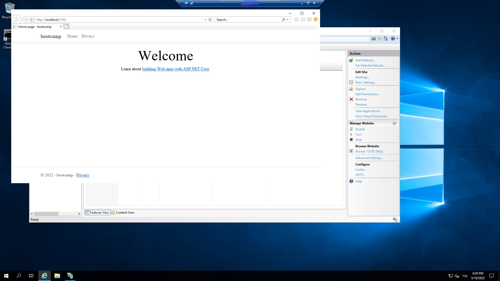

# IIS Web server

**Steps to create and build a Website: (IIS)**
1. enabled IIS in the Control Panel
 (Control Panel > Programs > Programs and Features > Turn Windows features on or off)
2. Created a new scratch .net core project on Visual Studio, Published it, and copied the files to the IIS site folder
3. Added newtonsoft.json package - Adding this package triggered a couple of changes:
- Added a couple of lines to the `.csproj file` - These lines tell the application that newtonjson is a dependency for the application
- After rebuilding the file `newtonsoft.Json.dll` was added to the `./publish` folder
4. When browsing to the website's ip address, I got an error code that told me that I was missing an IIS module.
5. Downloaded and installed [.net 6.0 hosting bundle](https://docs.microsoft.com/en-us/aspnet/core/host-and-deploy/iis/hosting-bundle?view=aspnetcore-6.0) and restarted the website which made it work just fine.
